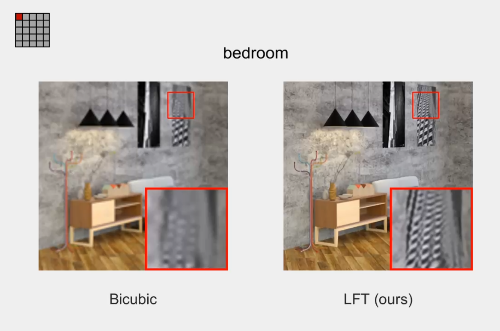

## LFT
#### PyTorch implementation of "*Light Field Image Super-Resolution with Transformers*", arXiv 2021. [<a href="https://arxiv.org/abs/2108.07597">pdf</a>].<br><br>

## Contributions:
* **We make the first attempt to adapt Transformers to LF image processing, and propose a Transformer-based network for LF image SR.** 
* **We propose a novel paradigm (i.e., angular and spatial Transformers) to incorporate angular and spatial information in an LF.** 
* **With a small model size and low computational cost, our LFT achieves superior SR performance than other state-of-the-art methods.**
<br><br>

## Codes and Models:

### Requirement
* **PyTorch 1.3.0, torchvision 0.4.1. The code is tested with python=3.6, cuda=9.0.**
* **Matlab (For training/test data generation and performance evaluation)**

### Datasets
**We used the EPFL, HCInew, HCIold, INRIA and STFgantry datasets for both training and test. Please first download our dataset via [Baidu Drive](https://pan.baidu.com/s/1mYQR6OBXoEKrOk0TjV85Yw) (key:7nzy) or [OneDrive](https://stuxidianeducn-my.sharepoint.com/:f:/g/personal/zyliang_stu_xidian_edu_cn/EpkUehGwOlFIuSSdadq9S4MBEeFkNGPD_DlzkBBmZaV_mA?e=FiUeiv), and place the 5 datasets to the folder **`./datasets/`**.**

### Train
* **Run **`Generate_Data_for_Training.m`** to generate training data. The generated data will be saved in **`./data_for_train/`** (SR_5x5_2x, SR_5x5_4x).**
* **Run **`train.py`** to perform network training. Example for training LFT on 5x5 angular resolution for 4x/2xSR:**
  ```
  $ python train.py --model_name LFT --angRes 5 --scale_factor 4 --batch_size 4
  $ python train.py --model_name LFT --angRes 5 --scale_factor 2 --batch_size 8
  ```
* **Checkpoint will be saved to **`./log/`**.**


### Test
* **Run **`Generate_Data_for_Test.m`** to generate test data. The generated data will be saved in **`./data_for_test/`** (SR_5x5_2x, SR_5x5_4x).**
* **Run **`test.py`** to perform network inference. Example for test LFT on 5x5 angular resolution for 4x/2xSR:**
  ```
  python test.py --model_name LFT --angRes 5 --scale_factor 4 \ 
  --use_pre_pth True --path_pre_pth './pth/LFT_5x5_4x_epoch_50_model.pth
  
  python test.py --model_name LFT --angRes 5 --scale_factor 2 \ 
  --use_pre_pth True --path_pre_pth './pth/LFT_5x5_2x_epoch_50_model.pth
  ```
* **The PSNR and SSIM values of each dataset will be saved to **`./log/`**.**
<br><br>
## Results:

* **Quantitative Results**
<p align="center">  </p>


* **Efficiency**
<p align="center">  </p>

* **Visual Comparisons**
<p align="center">  </p>

* **Angular Consistency**
<p align="center"> <a href="https://wyqdatabase.s3.us-west-1.amazonaws.com/LFT_video.mp4"></a> </p>


* **Spatial-Aware Angular Modeling**
<p align="center">  </p>
<br>


## Citiation
**If you find this work helpful, please consider citing:**
```
@Article{LFT,
    author    = {Liang, Zhengyu and Wang, Yingqian and Wang, Longguang and Yang, Jungang and Zhou, Shilin},
    title     = {Light Field Image Super-Resolution with Transformers},
    journal   = {arXiv preprint},
    month     = {August},
    year      = {2021},   
}

```
<br>

## Contact
**Any question regarding this work can be addressed to [zyliang@nudt.edu.cn](zyliang@nudt.edu.cn).**
