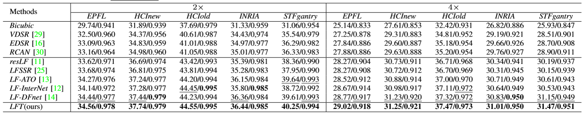
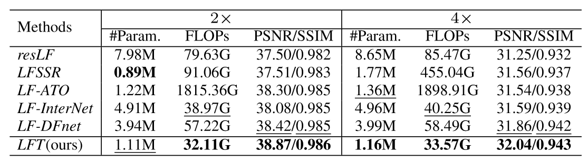
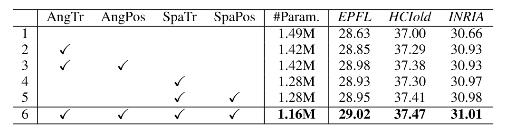

## LFT
#### PyTorch implementation of "*Light Field Image Super-Resolution with Transformers*", arXiv 2021. [<a href="">pdf</a>].<br><br>

## Contributions:
* **We make the first attempt to adapt Transformers to LF image processing, and propose a Transformer-based network for LF image SR.** 
* **We propose a novel paradigm (i.e., angular and spatial Transformers) to incorporate angular and spatial information in an LF.** 
* **With a small model size and low computational cost, our LFT achieves superior SR performance than other state-of-the-art methods.**
<br><br>

## Codes and Models:

### Requirement
* **PyTorch 1.3.0, torchvision 0.4.1. The code is tested with python=3.7, cuda=9.0.**
* **Matlab (For training/test data generation and performance evaluation)**

### Test
* **Coming Soon!** 

### Train
* **Coming Soon!** 
<br><br>
## Results:

* **Quantitative Results**
<p align="center">  </p>

* **Visual Comparisons**
<p align="center">  </p>

* **Efficiency**
<p align="center">  </p>

* **Angular Consistency**

* **Ablation Studies**
<p align="center">  </p>

* **Spatial-Aware Angular Modeling**
<p align="center">  </p>
<br>

## Citiation
**If you find this work helpful, please consider citing:**
```
@Article{LFT,
    author    = {Liang Zhengyu and Wang, Yingqian and Wang, Longguang and Yang, Jungang and Zhou, Shilin},
    title     = {Light Field Image Super-Resolution with Transformers},
    journal   = {arXiv preprint},
    month     = {August},
    year      = {2021},   
}

```
<br>

## Contact
**Any question regarding this work can be addressed to [zyliang@nudt.edu.cn](zyliang@nudt.edu.cn).**
